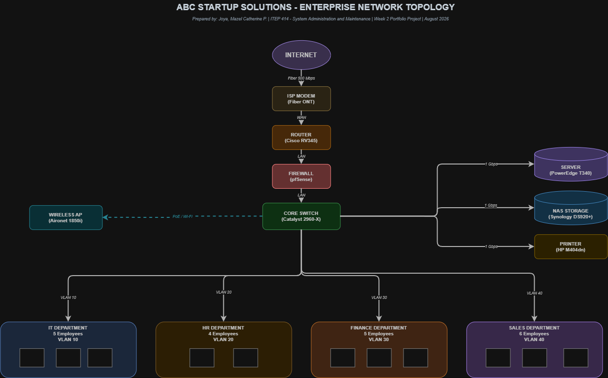

#  Enterprise Infrastructure Plan  - ABC Startup Solutions

> **ITEP 414 · System Administration and Maintenance**
> **Week 2 Portfolio Project**  - *100 points*
>
> **Author:** Joya, Mazel Catherine P.
> **Instructor:** John Randolf M. Penaredondo, MIT

---

## Table of Contents

1. [Executive Summary](#executive-summary)
2. [Learning Objectives](#learning-objectives)
3. [The Company](#the-company)
4. [Network Topology](#network-topology)
5. [Hardware Inventory](#hardware-inventory)
6. [Software Inventory](#software-inventory)
7. [Network Inventory](#network-inventory)
8. [Technologies Used](#technologies-used)
9. [Infrastructure Recommendations](#infrastructure-recommendations)
10. [Challenges Encountered](#challenges-encountered)
11. [Reflection](#reflection)
12. [References](#references)

**Downloads:** [Full Report (PDF)](EnterpriseInfrastructurePlan.pdf) · [Diagram PNG](diagrams/network-topology.png) · [Diagram PDF](diagrams/network-topology.pdf) · [Diagram Source](diagrams/network-topology.drawio)

---

## Executive Summary

Imagine a company that has employees, clients, and a business plan  - but zero computers, zero servers, and zero network. That is the starting point of this project.

As the **Junior System Administrator** of **ABC Startup Solutions**, my task was to build a complete IT infrastructure plan before the company spends its first peso on equipment. The final plan covers **11 hardware assets**, **11 software applications**, **8 network components**, a **VLAN-segmented network design**, and infrastructure recommendations backed by business logic  - all documented and published to GitHub.

**Key decisions at a glance:**

| Decision | Choice | Why |
|----------|--------|-----|
| Server OS | Ubuntu Server 22.04 LTS | Zero licensing cost, 5-year support |
| Workstation split | 15 desktops + 5 laptops | 15 fixed roles, 5 field roles (Sales) |
| Storage | Synology NAS + 2 external drives | Enforces the 3-2-1 backup rule |
| Security | pfSense firewall + VLANs + MFA | Defense-in-depth without big spending |
| Power protection | 21 UPS units | Philippines power fluctuations are real |

---

## Learning Objectives

| Type | Objectives |
|------|-----------|
| Knowledge | Explain the roles and responsibilities of a System Administrator; identify the hardware, software, and networking requirements of a small business; describe the purpose of IT documentation and infrastructure planning |
| Skills | Analyze organizational IT requirements; prepare professional IT inventories; design an enterprise network topology; create technical documentation using Markdown; present infrastructure planning professionally |
| Attitude | Professionalism, organization, technical communication, attention to detail, and critical thinking |

---

## The Company

**ABC Startup Solutions, Inc.** is a newly established software development company that builds custom web applications, mobile apps, and cloud-based business systems. It operates on the 5th Floor of CyberOne Tower, Ayala Avenue, Makati City, with a flat organizational structure  - ideal for fast decision-making and direct communication between departments.

**Employee distribution:**

| Department | Employees | Primary Function |
|------------|:---------:|------------------|
| Information Technology | 5 | Development, infrastructure, support |
| Human Resources | 4 | Recruitment, payroll, employee relations |
| Finance | 5 | Accounting, budgeting, billing |
| Sales | 6 | Client acquisition, proposals |
| **TOTAL** | **20** | |

**Current state of IT:** No computers · No server · No network · No internet · No security policies. Everything starts from scratch.

---

## Network Topology

The design follows a **star topology** with a single logical data path  - every packet entering or leaving the office passes through the router and firewall before reaching the internal network.

```
Internet → ISP Modem → Router → Firewall → Core Switch
                                              ├── Server (Ubuntu 22.04)
                                              ├── NAS Storage (DS920+)
                                              ├── External Backup (4TB × 2)
                                              ├── Printer (M404dn × 2)
                                              ├── Access Points (Aironet × 3)
                                              ├── VLAN 10  - IT Department (5)
                                              ├── VLAN 20  - HR Department (4)
                                              ├── VLAN 30  - Finance Department (5)
                                              └── VLAN 40  - Sales Department (6)
```

Each department gets its own VLAN so that a security incident in one segment cannot easily spread to another.



---

## Hardware Inventory

### Workstations & Displays

| Asset ID | Item | Qty | Department | Purpose |
|----------|------|:---:|------------|---------|
| HW-001 | Desktop  - Intel i5, 16GB RAM, 512GB NVMe | 15 | IT (4), HR (3), Finance (4), Sales (4) | Fixed daily workstations |
| HW-002 | Laptop  - Intel i5, 16GB RAM, 512GB NVMe | 5 | Sales | Client visits & presentations |
| HW-011 | Monitor  - Dell 24" FHD | 25 | All | Dual-monitor for developers |

### Server Room

| Asset ID | Item | Qty | Purpose |
|----------|------|:---:|---------|
| HW-003 | Dell PowerEdge T340  - Xeon E-2334, 32GB ECC, 2×1TB NVMe RAID 1, 2×4TB HDD RAID 1 | 1 | File server, app server, database |
| HW-004 | Cisco RV345 Dual WAN Router | 1 | Routing + VPN + backup WAN |
| HW-005 | Cisco Catalyst 2960-X 48-port Switch | 2 | Core switching + VLANs |
| HW-009 | Synology DS920+ NAS (2×4TB) | 1 | Central storage & backup target |
| HW-010 | External Backup Drive 4TB | 2 | Offline copies (3-2-1 rule) |

### Office Floor

| Asset ID | Item | Qty | Purpose |
|----------|------|:---:|---------|
| HW-006 | HP LaserJet Pro M404dn Printer | 2 | HR & Finance documents |
| HW-007 | APC Back-UPS Pro 1500VA | 21 | Power backup for 20 PCs + server |
| HW-008 | Cisco Aironet 1850i Access Point | 3 | Wi-Fi coverage, no dead spots |

> **Justification summary:** Quantities follow actual headcounts per department, plus spares. The single server consolidates services to control startup costs, RAID 1 protects against drive failure, and 21 UPS units shield against the Philippines' frequent power interruptions.

---

## Software Inventory

| Software | Version | License | Used For |
|----------|---------|---------|----------|
| Windows 11 Pro | 24H2 | Commercial | Workstation OS (BitLocker, domain join) |
| Ubuntu Server | 22.04 LTS | Open Source | Server OS  - file, app, database |
| Microsoft 365 Business | Standard | Subscription | Docs, spreadsheets, email, Teams |
| Visual Studio Code | 1.9x | Free | Code editor (IT team) |
| Git | 2.4x | Open Source | Version control |
| GitHub Desktop | 3.x | Free | Git GUI for the team |
| VirtualBox | 7.x | Open Source | Testing VMs + pfSense appliance |
| Google Chrome | Latest | Freeware | Standard browser |
| Microsoft Defender | Built-in | Included | Baseline antivirus |
| AnyDesk | Latest | Freemium | Remote support |
| 7-Zip | 24.x | Open Source | Compression & archives |

<details>
<summary><b>Why each software? (click to expand)</b></summary>

- **Windows 11 Pro**  - Home edition lacks BitLocker encryption and domain join, which a managed business environment needs.
- **Ubuntu Server**  - saves thousands of pesos in licensing while providing better-than-windows stability for core services.
- **Microsoft 365**  - automatic updates, cloud collaboration, and a single subscription covering all 20 employees.
- **VS Code + Git + GitHub Desktop**  - enforce version control discipline from the team's first commit.
- **VirtualBox**  - lets the IT team break things in a sandbox instead of the production server.
- **Defender**  - free, cloud-powered protection included with Windows; upgradeable to EDR later.
- **AnyDesk**  - one SysAdmin, 20 workstations; remote support saves hours of walking.
- **7-Zip**  - essential for compressed backups and developer archives.
</details>

---

## Network Inventory

| Component | Model / Spec | Qty | Role |
|-----------|--------------|:---:|------|
| ISP Modem | PLDT Fibr GPON ONT | 1 | Fiber → Ethernet gateway |
| Router | Cisco RV345 Dual WAN | 1 | Routing, VPN, backup ISP |
| Firewall | pfSense (VM on Ubuntu Server) | 1 | Traffic inspection & filtering |
| Managed Switch | Catalyst 2960-X 48-port | 2 | Wired connectivity + VLANs |
| Access Point | Cisco Aironet 1850i | 3 | Wireless coverage |
| Patch Panel | Cat6 24-port rackmount | 2 | Structured cabling termination |
| CAT6 Cable | UTP 350MHz, 305m box | 2 | Cabling runs to workstations |
| RJ45 Connectors | Cat6 pass-through | 500 | Cable termination |

---

## Technologies Used

| Tool | Where It Was Used |
|------|-------------------|
| Draw.io | Designing and exporting the network topology (PNG + PDF) |
| Markdown | Writing all project documentation and this README |
| Git & GitHub | Version control and publishing the portfolio |
| VS Code | Editing the documentation |
| VirtualBox | Evaluating the pfSense firewall setup as a VM |

---

## Infrastructure Recommendations

| Area | Recommendation | Key Reason |
|------|----------------|-----------|
| Internet | PLDT Fibr Enterprise 500 Mbps + static IP | Symmetric upload for code pushes, VPN host, SLA-backed repairs |
| Server | PowerEdge T340, ECC RAM, RAID 1 on all drives | ECC prevents silent corruption; RAID 1 survives drive failure |
| Backup | 3-2-1 rule: NAS + external + offsite rotation | One-day max data loss; survives fire, flood, theft |
| Security | pfSense + department VLANs + monthly patches | Contains breaches, closes known vulnerabilities |
| Antivirus | Microsoft Defender + Defender Firewall | Free baseline; layered with pfSense |
| Passwords | 12+ chars, MFA, Bitwarden, 90-day rotation | Blocks brute force; MFA stops stolen credentials |
| Expansion | Spare switch ports, cloud migration path (AWS/Azure) | Scale without a full redesign |

---

## Challenges Encountered

1. **Designing the network diagram.** Getting the data flow right  - from the ISP modem down to each department's VLAN  - took several revisions. I solved this by starting with the core path (Internet → modem → router → firewall → core switch) first, then adding branches for the server room and each department.
2. **Justifying every inventory item.** Every quantity had to answer "why does this exist?"  - 15 desktops, 21 UPS units, 2 switches. I solved this by tying each asset to a real business need (headcounts, Filipino power conditions, spares for growth).
3. **Keeping the README and the full report consistent.** The reflection had to stay within the 300-500 word limit across both documents, so I wrote it once, trimmed it, and reused the same version in the PDF report.

---

## Reflection

Infrastructure planning, I learned, starts with the business  - not the hardware. Every unit I listed had to answer the question *"why does this exist?"*  - 15 desktops because 15 roles are desk-bound, 21 UPS units because brownouts are a Philippine reality, 2 switches because 96 ports future-proof a 20-employee office. The full 500-word reflection is in the [portfolio report](EnterpriseInfrastructurePlan.pdf), but my biggest takeaway: a well-documented plan is a decision record  - a tool for whoever manages this network next.

---

## References

1. CompTIA  - [A+ Certification](https://www.comptia.org/certifications/a)
2. CompTIA  - [Network+ Certification](https://www.comptia.org/certifications/network)
3. Cisco  - [Catalyst 2960-X Series](https://www.cisco.com)
4. Dell  - [PowerEdge T340 Specifications](https://www.dell.com)
5. [pfSense Open Source Firewall](https://www.pfsense.org)
6. Synology  - [DiskStation DS920+](https://www.synology.com)
7. Ubuntu  - [Server 22.04 LTS](https://ubuntu.com/server)
8. Microsoft  - [Windows 11 Pro for business](https://www.microsoft.com)
9. AWS  - [SysOps Administrator Certification](https://aws.amazon.com/certification)
10. Microsoft Learn  - [Azure Administrator (AZ-104)](https://learn.microsoft.com)

---
