# Enterprise Server Deployment and Operating System Installation - ABC Startup Solutions

> **ITEP 414 · System Administration and Maintenance**
> **Week 3 Portfolio Project** - *100 points*
>
> **Author:** Joya, Mazel Catherine P.
> **Instructor:** John Randolf M. Penaredondo, MIT

---

## Table of Contents

1. [Project Overview](#project-overview)
2. [Learning Objectives](#learning-objectives)
3. [Virtual Machine Specifications](#virtual-machine-specifications)
4. [Part A - Ubuntu Server Installation](#part-a---ubuntu-server-installation)
5. [Part B - Server Verification](#part-b---server-verification)
6. [BIOS vs UEFI Highlights](#bios-vs-uefi-highlights)
7. [Boot Process Flowchart](#boot-process-flowchart)
8. [Challenges Encountered](#challenges-encountered)
9. [Reflection](#reflection)
10. [References](#references)

---

## Project Overview

Operating Systems serve as the foundation of every enterprise IT infrastructure. Before a server can host websites, databases, cloud services, or enterprise applications, it must first be properly installed, configured, secured, and documented.

In this project, I assumed the role of a **Junior System Administrator** for **ABC Startup Solutions** and deployed the company's first Linux server - an **Ubuntu Server 26.04 LTS** virtual machine. I performed a complete operating system installation, configured essential settings, verified the installation, and documented every step so that future administrators can reproduce the installation.

The server will later be used for file sharing, remote administration, database hosting, web hosting, and internal services.

---

## Learning Objectives

| Type | Objectives |
|------|-----------|
| Knowledge | Explain the purpose of an operating system in enterprise environments; differentiate BIOS and UEFI firmware; explain the stages of the computer boot process; compare Ubuntu Server, Windows Server, and Rocky Linux |
| Skills | Install Ubuntu Server in a virtual machine; configure server settings during installation; enable secure remote administration using SSH; verify server functionality; document installation procedures; produce professional technical documentation |
| Professional Outcomes | Installed Ubuntu Server; configured a working Linux server; produced a deployment guide; created installation documentation; updated GitHub portfolio |

---

## Virtual Machine Specifications

| Component | Minimum Requirement | Configured |
|-----------|--------------------:|------------|
| Name | Ubuntu-Server-Week03 | Ubuntu-Server-Week03 |
| Operating System | Ubuntu Server LTS | Ubuntu Server 26.04 LTS (kernel 7.0.0-29-generic x86_64) |
| RAM | 4 GB | 4 GB |
| CPU | 2 Virtual Processors | 2 |
| Storage | 40 GB (VDI/VMDK) | 40 GB |
| Network | NAT (or Bridged) | NAT |
| Optical Drive | Ubuntu Server ISO | Ubuntu Server 26.04 LTS ISO |

---

## Part A - Ubuntu Server Installation

The installation was performed using the **Subiquity** text-based installer inside **Oracle VirtualBox**. The following steps were completed:

### Step 1 - Language

- Selected **English**.

### Step 2 - Keyboard Layout

- Selected **English (US)**.

### Step 3 - Network Configuration

- Accepted **DHCP** as instructed by the module.
- The installer detected the interface `enp0s3` and assigned the IP address **10.0.2.15/24** (NAT network).

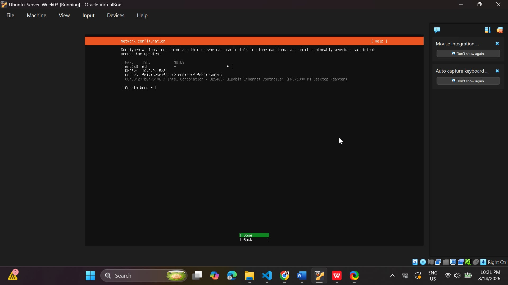

### Step 4 - Hostname

- Assigned the hostname **`server01`** as required by the module.

### Step 5 - User Account

Created a non-root administrative user:

| Field | Value |
|-------|-------|
| Full Name | Mazel Catherine P. Joya |
| Server Name | server01 |
| Username | cathy |
| Password | Strong password (hidden) |

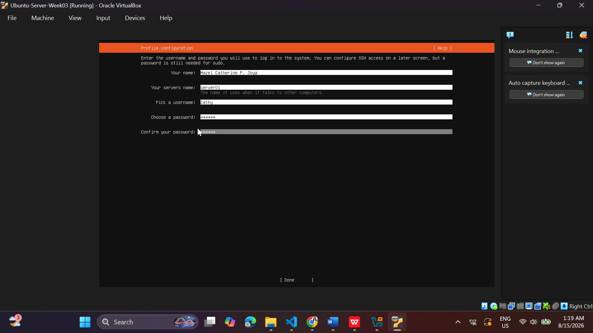

### Step 6 - Disk Partitioning

- Selected **Guided - Use an Entire Disk**.
- Enabled **LVM group** for flexible storage management.
- Disk size: **40 GB**.

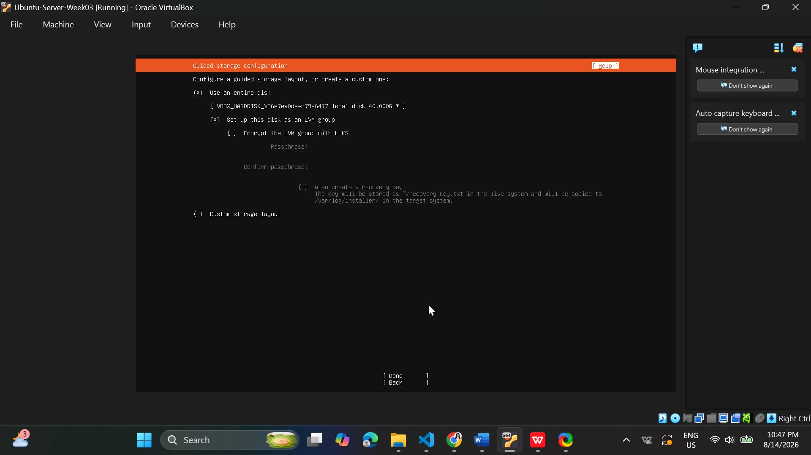

### Step 7 - SSH Server

- Enabled **Install OpenSSH Server** for secure remote administration.

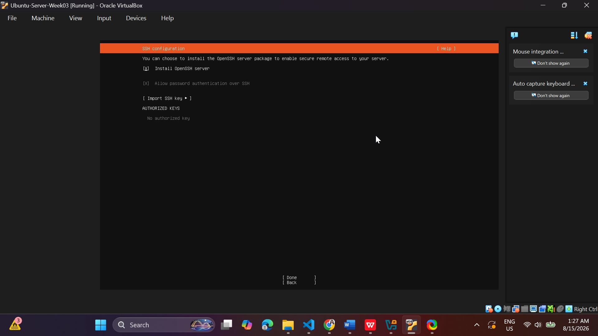

### Step 8 - Additional Packages

- No additional packages were installed, per module instructions.

### Step 9 - Complete Installation

- Installation proceeded successfully; the system was restarted after completion and the ISO was removed.

---

## Part B - Server Verification

After installation, the server was verified using the following tasks:

### Task 1 - Login

Logged in using the account `cathy` created during installation.

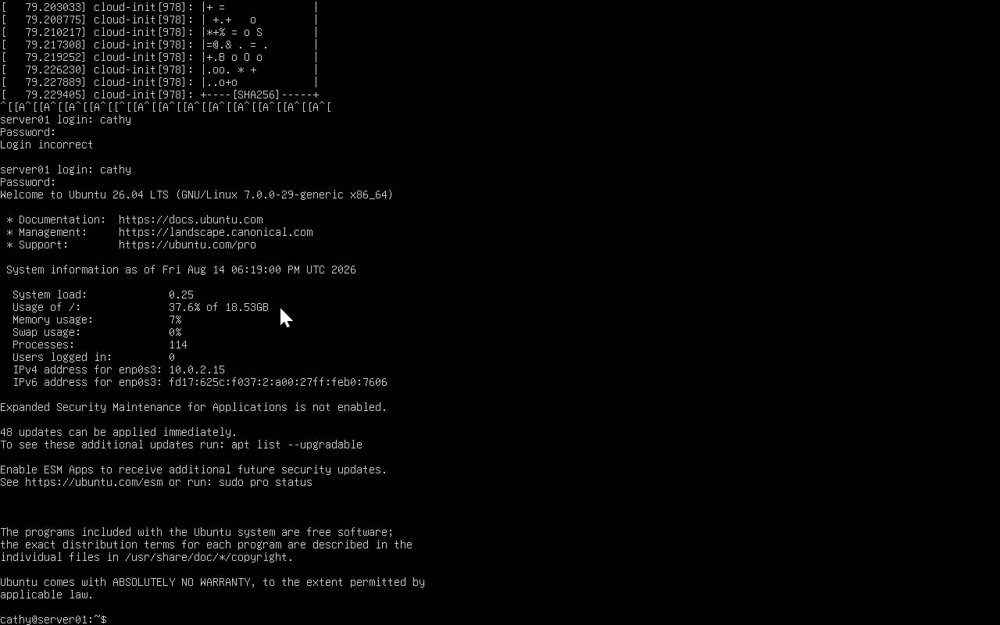

### Task 2 - Verify Hostname

```bash
hostname
```

Output: `server01`

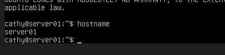

### Task 3 - Verify IP Address

```bash
ip addr
```

The `enp0s3` interface shows the assigned IP address **10.0.2.15/24**.

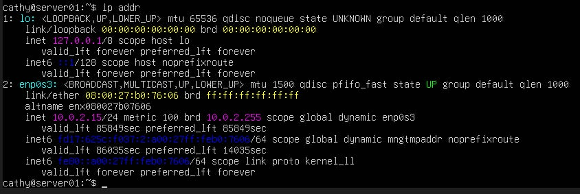

### Task 4 - Test Internet Connectivity

```bash
ping -c 4 google.com
```

Result: **4 packets transmitted, 4 received, 0% packet loss** - internet connectivity verified.

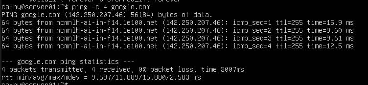

### Task 5 - Update the Server

```bash
sudo apt update
sudo apt upgrade -y
```

Result: 53 packages upgradable, 48 packages upgraded successfully.

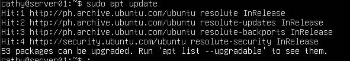

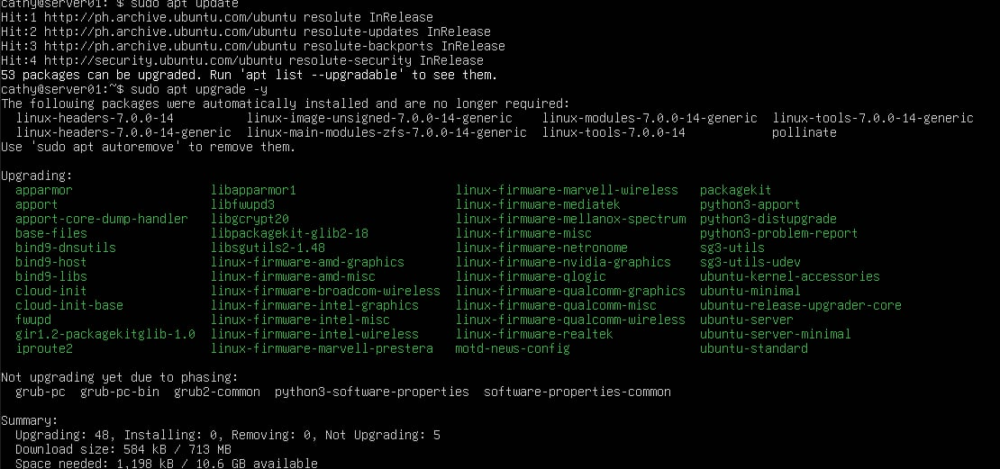

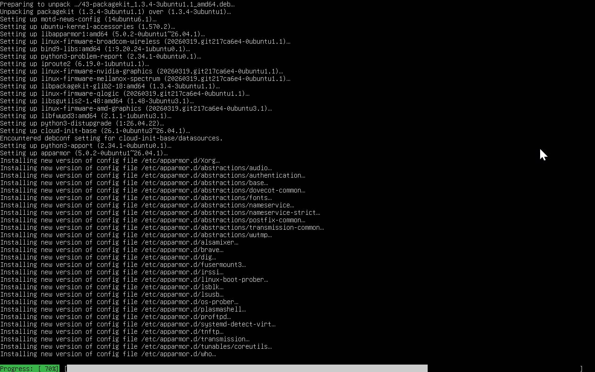

### Task 6 - Verify SSH Service

```bash
systemctl status ssh
```

Result: Service is **active (running)** and listening on port 22.

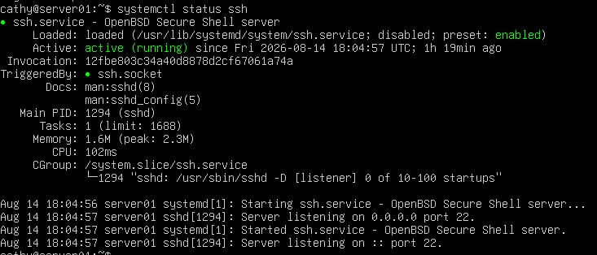

---

## BIOS vs UEFI Highlights

BIOS and UEFI are the two firmware standards that start a computer before the operating system loads. Key differences:

| Aspect | BIOS | UEFI |
|--------|------|------|
| Disk limit | 2 TB (MBR) | 9.4 ZB (GPT) |
| Partitions | Max 4 primary | Up to 128 |
| Security | None | Secure Boot (signature verification) |
| Boot speed | Slower (sequential) | Faster (parallel) |
| Status | Legacy / retired | Standard on all modern systems |

**Why UEFI replaced BIOS:** modern drives exceed BIOS's 2 TB limit, BIOS has zero protection against bootkits while UEFI's Secure Boot verifies every boot loader, and UEFI boots faster with parallel hardware initialization. The industry sealed the transition when Microsoft required UEFI for Windows 8 certification.

📄 Full report: [BIOS_vs_UEFI.pdf](BIOS_vs_UEFI.pdf)

---

## Boot Process Flowchart

The Ubuntu boot process in 9 stages:

1. **Power On** - power button pressed
2. **BIOS/UEFI Initialization** - POST tests hardware
3. **Boot Device Detection** - firmware finds the boot drive
4. **Boot Loader (GRUB)** - shows menu, loads kernel
5. **Linux Kernel** - decompresses, initializes drivers
6. **init/systemd (PID 1)** - first userspace process
7. **Services Start** - SSH, networking, etc.
8. **Login Prompt** - ready for users

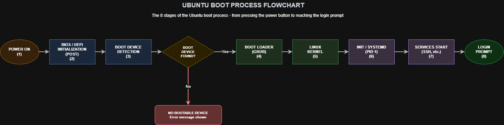

📄 Downloads: [Flowchart PNG](diagrams/boot-process.png) · [Flowchart PDF](diagrams/BootProcessFlowchart.pdf) · [Draw.io Source](diagrams/boot-process.drawio)

---

## Operating System Comparison

Windows Server, Ubuntu Server, and Rocky Linux compared across licensing, interface, package management, security, performance, and typical enterprise use:

| Aspect | Windows Server | Ubuntu Server | Rocky Linux |
|--------|---------------|---------------|-------------|
| Licensing | Commercial (per core + CALs) | Free (open source) | Free (RHEL rebuild) |
| Interface | GUI + PowerShell | Terminal by default | Terminal by default |
| Package manager | MSI / WSUS | APT (.deb) | DNF (.rpm) |
| Security | Secure Boot, BitLocker | AppArmor, UFW | SELinux (default on) |
| Best for | Active Directory, Exchange | Web, DB, cloud, startups | RHEL-compatible production |

**For ABC Startup Solutions:** Ubuntu Server wins on zero licensing cost, lighter footprint, and the biggest community for a startup budget.

📄 Full report: [OS_Comparison.pdf](OS_Comparison.pdf)

---

## Windows Server Evaluation Installation (Bring-Home)

As required by the module's bring-home assignment, I also installed **Windows Server 2025 Standard Evaluation (Desktop Experience)** in a separate virtual machine.

| Component | Value |
|-----------|-------|
| VM Name | WindowsServer-Week03 |
| Edition | Windows Server 2025 Standard Evaluation |
| RAM | 4096 MB |
| CPU | 2 Virtual Processors |
| Storage | 50 GB |
| Computer Name | WIN-SERVER-01 |
| Administrator Password | Set during installation (strong password) |
| License | Evaluation, valid 180 days |

**Installation steps completed:**

1. Created the VM in VirtualBox with the Windows Server 2025 Evaluation ISO
2. Selected **Standard Evaluation (Desktop Experience)** for the full GUI
3. Installed on Disk 0 (unallocated space, 40+ GB)
4. Waited through the multi-reboot installation (10% → 33% → complete)
5. Set the **Administrator** password during the "Customize settings" (OOBE) step
6. Unlocked with Ctrl+Alt+Delete and logged in successfully
7. Renamed the computer to **WIN-SERVER-01** via System Properties
8. Restarted and verified the server desktop with Server Manager

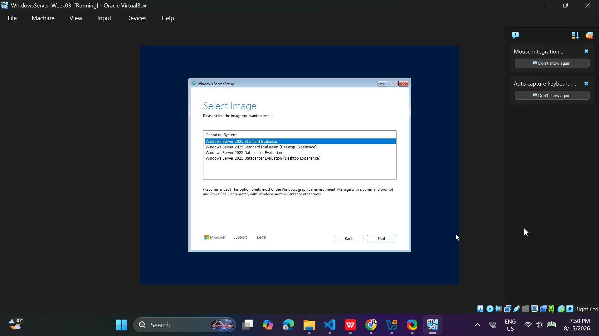

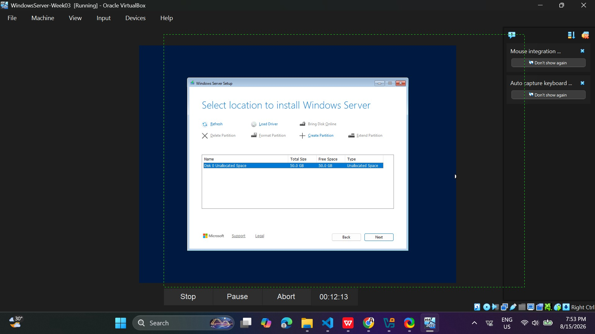

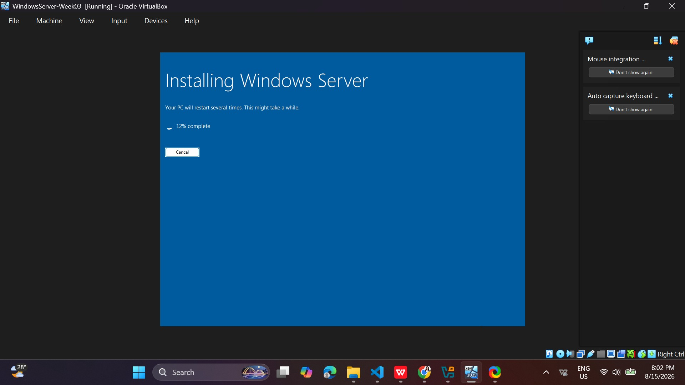

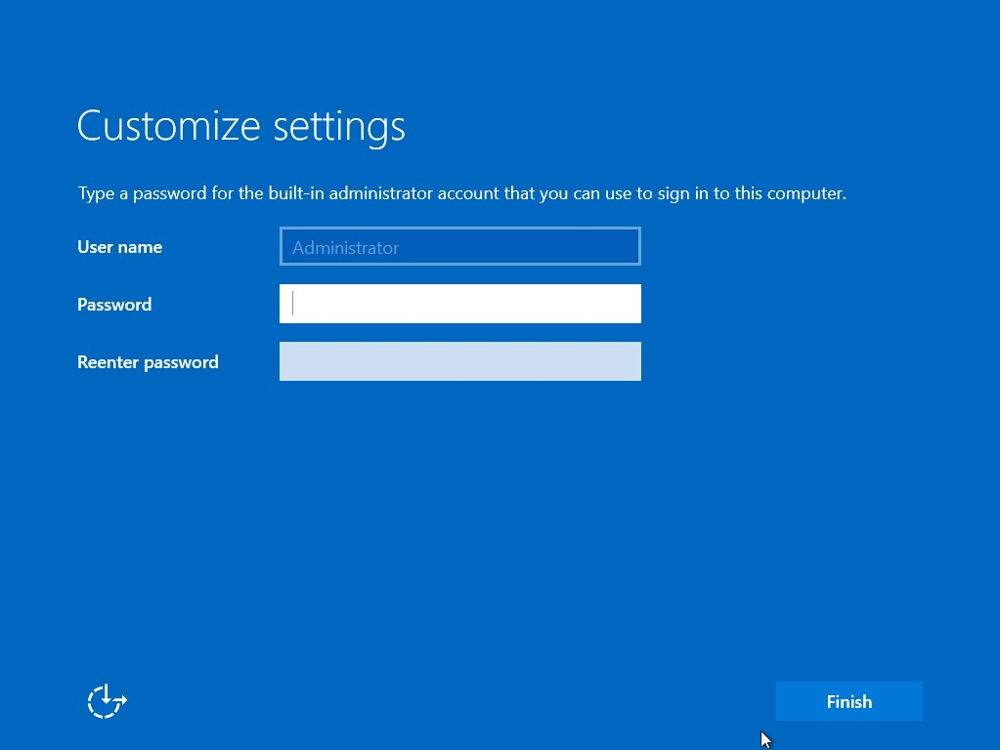

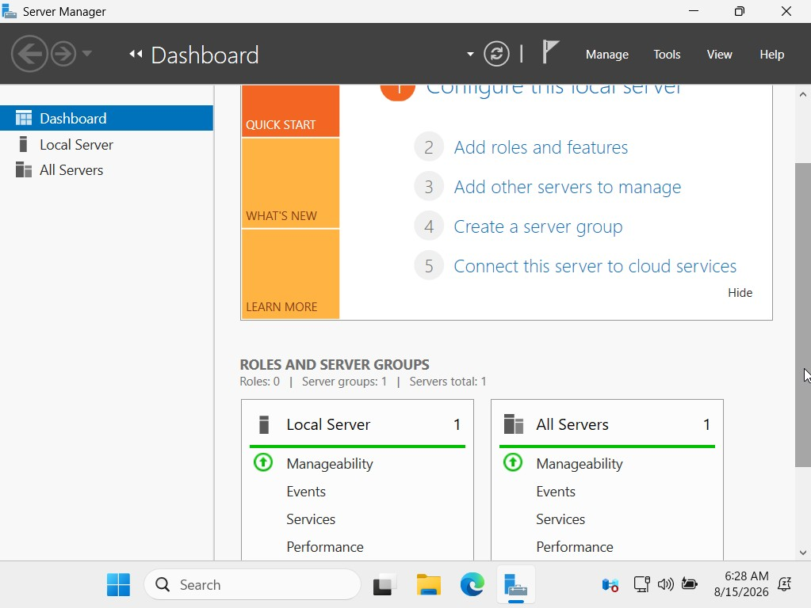

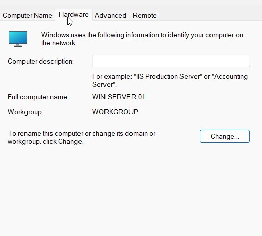

---

## Challenges Encountered

1. **The installation took hours.** The whole setup, from creating the VM to finishing the Ubuntu install, took me several hours of waiting. There were multiple restarts and long progress bars, and I kept checking the screen every few seconds just to see if it was done. I learned to be patient and let the installation finish instead of interrupting it.
2. **My laptop started lagging.** Running the virtual machine used up a lot of memory, and my laptop became slow. Every click took a few seconds, and even typing felt delayed. I fixed this by closing the other programs I was not using and giving the VM room to work. It reminded me that system administration also means managing the resources of the machine you are working on.
3. **My first login attempt failed.** My initial login returned "Login incorrect" because I mistyped the password. I carefully re-entered the correct password and logged in successfully - a reminder that Linux usernames and passwords are case-sensitive and must be entered exactly.
4. **I encountered errors during the setup.** Some steps did not go smoothly at first, and I had to look at the error messages, figure out what went wrong, and fix them one at a time until everything worked. Being able to read the errors and solve them on my own was the most useful skill I practiced this week.

---

## Reflection

This week, I deployed my first real Linux server. The experience felt completely different from installing Windows: no graphical wizard, no click-through installer - just a text-based interface where every decision mattered. Partitioning with LVM, setting the hostname to `server01`, creating the `cathy` account, and enabling OpenSSH all had to be done deliberately, and each choice affects how the server behaves for its entire life.

The verification phase taught me that a system administrator never assumes - we prove. Running `hostname`, `ip addr`, `ping`, `apt update`, and `systemctl status ssh` one by one gave me measurable evidence that the server was working, and capturing each result as a screenshot built the documentation trail the module demands.

Installing Windows Server 2025 right after Ubuntu made the contrast even clearer. Windows gave me a graphical Server Manager and a familiar desktop, while Ubuntu asked me to think in commands. Both installations taught me the same underlying lesson: an operating system is only as reliable as the choices made during installation - hostnames, passwords, partitions, and services all matter.

Most importantly, I learned that documentation is part of the job. The module asked me to record every step because a future administrator - or my future self - will need to reproduce this installation. This is the mindset that separates hobbyists from professionals.

---

## References

1. Ubuntu - [Server 26.04 LTS](https://ubuntu.com/server)
2. Oracle - [VirtualBox Manual](https://www.virtualbox.org/manual)
3. Canonical - [Ubuntu Server Documentation](https://ubuntu.com/server/docs)
4. OpenSSH - [OpenSSH Documentation](https://www.openssh.com/manual.html)
